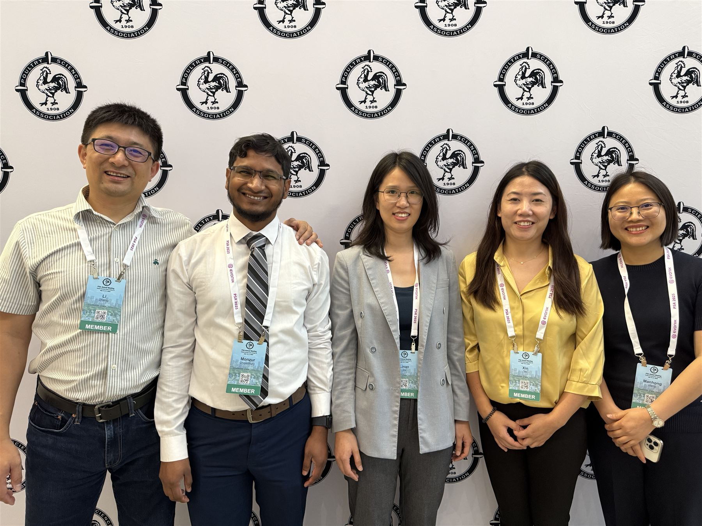

::: {.hero-home}
::: {.hero-copy-panel}
::: {.hero-copy}
[Zhang Lab · Mississippi State University]{.eyebrow}

# Advancing food safety [through]{.accent-word} molecular innovation

::: {.hero-lede}
We study the microbiomes of food production systems — developing rapid
pathogen diagnostics, sequencing genomes, and building the science that keeps
food safe from farm to table.
:::

::: {.hero-buttons}
[Our Research](research.qmd){.btn-maroon}
[Join the Lab](join.qmd){.btn-ghost}
:::
:::
:::

::: {.hero-photo}
{fig-alt="The Zhang Lab team at the 2025 Poultry Science Association meeting"}
:::
:::

::: {.band .band-paper}
::: {.band-inner .band-center .reveal-up}
[What We Do]{.eyebrow}

## Microbes shape food safety. [We decode]{.accent-word} them.

Our laboratory integrates **agricultural microbiomes**, **microbial genomics**,
and **bioinformatics** to develop practical solutions for pathogen detection,
characterization, and control. We work at the intersection of fundamental
microbiology and applied food safety — building tools and knowledge that
directly benefit industry, regulatory agencies, and public health.
:::
:::

::: {.band .band-stone}
::: {.band-inner}
::: {.band-center .reveal-up}
[Research Programs]{.eyebrow}

## Six programs, [one mission:]{.accent-word} safer food

::: {.rule-gold}
:::
:::

::: {.card-grid .reveal-up}
::: {.zl-card}
[[<i class="bi bi-diagram-3" aria-hidden="true"></i>]{.icon-badge}]{.icon-row}

### [Agricultural Microbiome](research.qmd#microbiome)

Culturomics and metagenomics to characterize microbial communities in food
production systems — and to discover beneficial microbes.
:::

::: {.zl-card}
[[<i class="bi bi-search" aria-hidden="true"></i>]{.icon-badge}]{.icon-row}

### [Molecular Detection](research.qmd#detection)

Rapid, field-deployable diagnostics: LAMP assays, multiplex qPCR, and
bioluminescent pathogen tracking.
:::

::: {.zl-card}
[[<i class="bi bi-shield-plus" aria-hidden="true"></i>]{.icon-badge}]{.icon-row}

### [Vaccine Development](research.qmd#vaccines)

Reverse vaccinology and host-pathogen interaction studies to stop foodborne
pathogens at the source.
:::

::: {.zl-card}
[[<i class="bi bi-cpu" aria-hidden="true"></i>]{.icon-badge}]{.icon-row}

### [Genomics & Bioinformatics](research.qmd#wgs)

High-throughput Oxford Nanopore pipelines and custom workflows for
serotyping, MLST, and resistance profiling.
:::

::: {.zl-card}
[[<i class="bi bi-graph-up" aria-hidden="true"></i>]{.icon-badge}]{.icon-row}

### [Pathogen Epidemiology](research.qmd#epidemiology)

Surveillance and molecular epidemiology of *Salmonella*, *Campylobacter*,
and pathogenic *E. coli* across production systems.
:::

::: {.zl-card}
[[<i class="bi bi-droplet-half" aria-hidden="true"></i>]{.icon-badge}]{.icon-row}

### [Pathogen Biofilms](research.qmd#biofilms)

How foodborne pathogens persist on processing surfaces — and science-based
strategies to stop them.
:::
:::
:::
:::

::: {.band .band-dark}
::: {.band-inner .band-center .reveal-up}
[In the Press]{.eyebrow}

## The lab [in the]{.accent-word} media

::: {.media-strip}
[MAFES Discovers [· Billion-Dollar Bacteria Breakthrough]{.outlet-note}](https://www.mafes.msstate.edu/discovers/article.php?id=350)
[The Microbiologist [· Rapid test for a billion-dollar pathogen]{.outlet-note}](https://www.the-microbiologist.com/news/ami-members-develop-rapid-test-for-bacterium-that-costs-poultry-industry-billions-globally/5598.article)
[MAFES Discovers [· Fowl Play: a chicken vaccine]{.outlet-note}](https://www.mafes.msstate.edu/discovers/article.php?id=321)
[WATTPoultry [· Enhancing food safety]{.outlet-note}](https://www.wattagnet.com/home/article/15531393/enhancing-food-safety-to-feed-the-worlds-growing-population-wattagnet)
[Meatingplace [· Campylobacter vaccine research]{.outlet-note}](https://www.meatingplace.com/Industry/TechnicalArticles/Details/104203)
[USPOULTRY [· 2024 Research Newsletter]{.outlet-note}](https://www.uspoultry.org/files/USPOULTRY2024-ResearchEdition.pdf)
:::
:::
:::

::: {.band .band-paper}
::: {.band-inner}
::: {.band-center .reveal-up}
[Latest Updates]{.eyebrow}

## What's growing [in the]{.accent-word} lab

::: {.rule-gold}
:::
:::

::: {.news-strip .reveal-up}
::: {#news-strip}
:::
:::

::: {.band-center .strip-cta}
[All news](news/index.qmd){.btn-ghost}
:::
:::
:::

::: {.band .band-maroon}
::: {.band-inner .reveal-up}
::: {.band-center}
[By the Numbers]{.eyebrow}

## Research [with]{.accent-word} reach
:::

::: {.stat-row}
::: {.stat}
[67+]{.stat-number}
[Peer-reviewed publications]{.stat-label}
:::

::: {.stat}
[6]{.stat-number}
[Research programs]{.stat-label}
:::

::: {.stat}
[18+]{.stat-number}
[Student awards since 2019]{.stat-label}
:::

::: {.stat}
[500+]{.stat-number}
[Pathogen isolates characterized]{.stat-label}
:::
:::

::: {.band-center .funding-note}
Our research is supported by **USDA ARS**, **USDA NIFA**, the
**U.S. Poultry & Egg Association**, **MAFES**, and industry partners.
:::
:::
:::

::: {.band .band-stone}
::: {.band-inner .band-center .reveal-up}
[Join Us]{.eyebrow}

## Curious about microbes? [So are]{.accent-word} we.

We welcome undergraduates, graduate students, and postdocs who want to work
on real problems in food safety with genomics, microbiology, and
bioinformatics. No prior sequencing experience required — bring curiosity.

::: {.hero-buttons .buttons-center}
[How to apply](join.qmd){.btn-maroon}
[Meet the team](people.qmd){.btn-ghost}
:::
:::
:::
