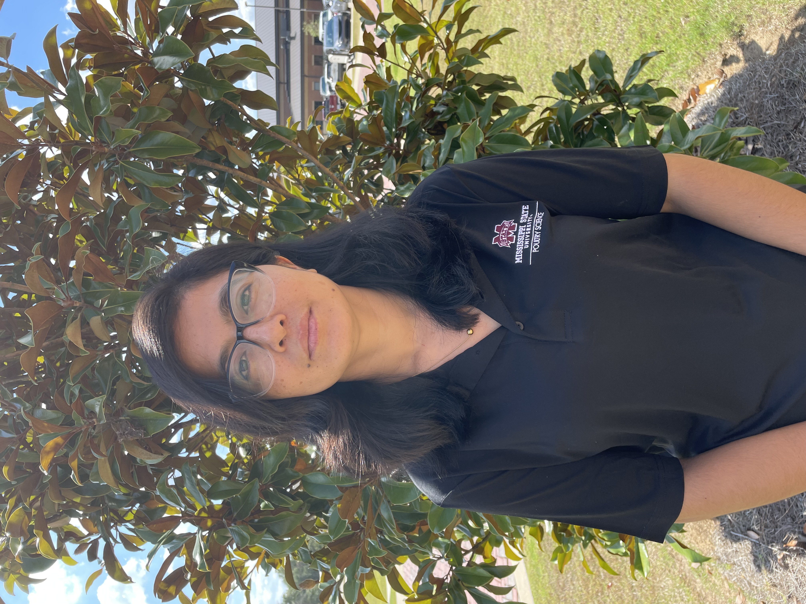
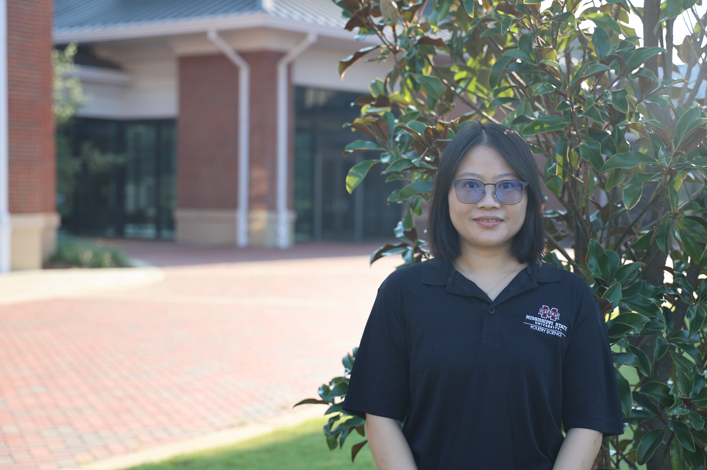
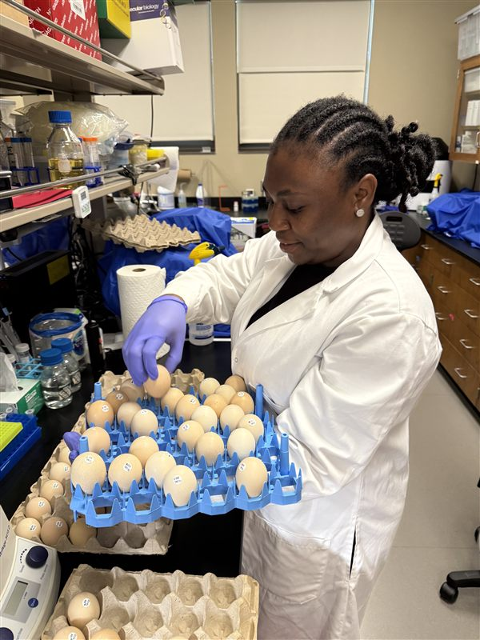
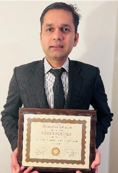
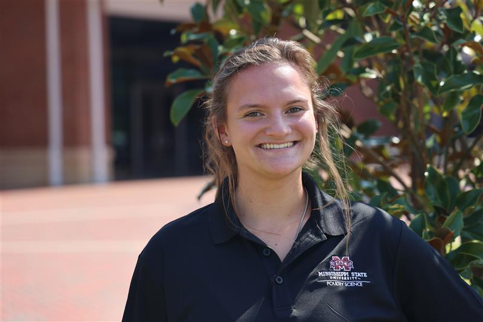
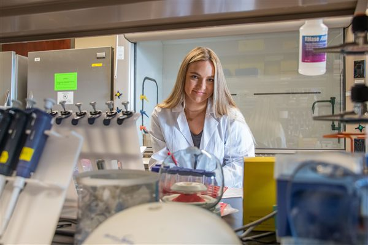

## Principal Investigator

::: {.person-entry}
::: {.columns}
::: {.column width="30%"}
{fig-alt="Dr. Li Zhang"}
:::

::: {.column width="70%"}
### Li Zhang

Ph.D. in Nutrition, Mississippi State University, 2017

Ph.D. in Agriculture Biological Environmental & Energy Engineering, Jilin University, China, 2013

Dr. Zhang's research focuses on agricultural microbiomes, microbial genomics, vaccine development, and food safety. His lab develops advanced molecular diagnostic tools (LAMP, qPCR) and applies whole-genome sequencing and bioinformatics to address critical challenges in poultry health and food safety.

[GitHub](https://github.com/lz245) | [MSU Profile](https://www.poultry.msstate.edu/people/lz245)

**Email:** l.zhang (at) msstate.edu
:::
:::
:::

---

## Research Faculty

::: {.person-entry}
::: {.columns}
::: {.column width="30%"}
{fig-alt="Dr. Linan Jia"}
:::

::: {.column width="70%"}
### Dr. Linan Jia

Assistant Research Professor

Ph.D. in Agricultural Science, Mississippi State University

M.S. in Animal Nutrition, Agricultural University of Hebei

B.S. in Animal Science, Hebei University

Dr. Jia specializes in poultry health and disease prevention, with a focus on understanding the molecular mechanisms underlying poultry pathogens and meat quality issues. She integrates advanced biotechnology and computational approaches to develop innovative solutions for the poultry industry. Her research aims to improve animal welfare and food safety through the development of new prevention and treatment strategies.

[Google Scholar](https://scholar.google.com/citations?user=KkyDvl8AAAAJ&hl=en) | [MSU Profile](https://www.poultry.msstate.edu/people/lj912)

**Email:** lj912 (at) msstate.edu
:::
:::
:::

---

## Research Technician

::: {.person-entry}
::: {.columns}
::: {.column width="30%"}
{fig-alt="Elianna Walters"}
:::

::: {.column width="70%"}
### Elianna Walters

Research Associate

**Email:** erw263 (at) msstate.edu
:::
:::
:::

---

## Postdoctoral Researchers

::: {.person-entry}
::: {.columns}
::: {.column width="30%"}
{fig-alt="Dr. Xin Ye"}
:::

::: {.column width="70%"}
### Dr. Xin Ye

Postdoctoral Research Associate

Ph.D. in Horticulture, Mississippi State University (2021)

M.S. in Chemistry, Polytechnic Institute of New York University (2013)

B.A. in Chemistry, Saint Mary's University of Minnesota (2011)

Dr. Ye brings a unique interdisciplinary background combining chemistry and plant biology to the lab. Her research experience spans molecular biology techniques including cloning, qPCR, RNA-seq, proteomics, and protein expression/purification. She has expertise in bioinformatics tools (R, Python, SQL, Geneious) and has worked on projects involving gene expression analysis, systemic immunity, and stress responses. Her technical skills in Western blotting, ELISA, and cell culture complement the lab's research on host-pathogen interactions and molecular detection methods.

**Email:** xy108 (at) msstate.edu
:::
:::
:::

::: {.person-entry}
::: {.columns}
::: {.column width="30%"}
{fig-alt="Dr. Huanling Xing"}
:::

::: {.column width="70%"}
### Dr. Huanling Xing

Postdoctoral Research Associate

Ph.D. in Preventive Veterinary Medicine, South China Agricultural University (2024)

M.S. in Bioengineering, South China Agricultural University (2020)

B.S. in Food Quality and Safety, Shanxi Agricultural University (2017)

Dr. Xing brings seven years of research experience in natural antimicrobial compounds, with particular expertise in cinnamon essential oils and their pharmacological activities. Her doctoral research focused on the mechanism of cinnamon essential oil in inhibiting avian colibacillosis (E. coli infection in poultry) and its clinical applications. She has extensive technical skills in GC-MS, LC-MS, RT-qPCR, Western blotting, and electron microscopy (SEM/TEM). Her research interests include antibacterial mechanisms, natural product-based interventions for poultry pathogens, and food safety applications.

**Email:** hx66 (at) msstate.edu
:::
:::
:::

---

## Ph.D. Students

::: {.person-entry}
::: {.columns}
::: {.column width="30%"}
{fig-alt="Sunita Shrestha"}
:::

::: {.column width="70%"}
### Sunita Shrestha

Candidate for Ph.D. in Poultry Science

Sunita is working on pathogen genomics and vaccine development strategies for poultry pathogens. Her research focuses on identifying and characterizing vaccine candidates against avian pathogens using reverse vaccinology approaches.

**Award:** Best Oral Presentation Award (SCAD category) at IPSF 2026, 2025 Lallemand Animal Nutrition Scholarship Finalist

**Email:** ss4440 (at) msstate.edu
:::
:::
:::

::: {.person-entry}
::: {.columns}
::: {.column width="30%"}
{fig-alt="Manhong Wang"}
:::

::: {.column width="70%"}
### Manhong Wang

Candidate for Ph.D. in Poultry Science

Manhong is developing culturomics approaches to isolate and characterize beneficial bacteria from the poultry gut microbiome. His research aims to identify probiotics that can improve poultry health and reduce pathogen colonization.

**Award:** IPSF 2026 Certificate of Excellence at Pathology, IPSF 2026 Travel Award, 2024 International Paper Scholarship ($1,500), Mississippi Poultry Association

**Email:** mw2224 (at) msstate.edu
:::
:::
:::

---

## M.S. Students

::: {.person-entry}
::: {.columns}
::: {.column width="30%"}
{fig-alt="Rita Ugoh"}
:::

::: {.column width="70%"}
### Rita Ugoh

Candidate for M.S. in Food Science

Rita is characterizing spoilage bacteria in catfish using culturomics approaches for the Mississippi Center for Food Safety. Her work aims to improve quality control and extend shelf life in catfish processing.

**Email:** ru90 (at) msstate.edu
:::
:::
:::

::: {.person-entry}
::: {.columns}
::: {.column width="30%"}
{fig-alt="Haley Nabors"}
:::

::: {.column width="70%"}
### Haley Nabors

Candidate for M.S. in Poultry Science

Haley is investigating antibiotic resistance and multi-drug resistance patterns in *Clostridium perfringens* isolated from diseased chickens. Her research contributes to understanding antimicrobial resistance in poultry pathogens.

Expected graduation: 2027

**Email:** hln80 (at) msstate.edu
:::
:::
:::

---

## Undergraduate Researchers

::: {.person-entry}
::: {.columns}
::: {.column width="30%"}
<!-- {fig-alt="Zoe Lohf"} -->
:::

::: {.column width="70%"}
### Zoe Lohf

Undergraduate Research Assistant

Zoe joined the lab in 2025 supporting laboratory operations and research projects.
:::
:::
:::

::: {.person-entry}
::: {.columns}
::: {.column width="30%"}
<!-- {fig-alt="Keaura Mearday"} -->
:::

::: {.column width="70%"}
### Keaura Mearday

Undergraduate Research Assistant

Keaura joined the lab in 2025 supporting laboratory operations and research projects.
:::
:::
:::

---

## Former Lab Members

### Former Postdocs

::: {.person-entry}
::: {.columns}
::: {.column width="30%"}
{fig-alt="Dr. Monzur Chowdhury"}
:::

::: {.column width="70%"}
### Dr. Monzur Chowdhury

Former Postdoctoral Research Associate

Research focus: Pathogens, host-pathogen interactions, molecular & cellular biology

**Now:** Researcher, Mississippi State University
:::
:::
:::

::: {.person-entry}
::: {.columns}
::: {.column width="30%"}
{fig-alt="Dr. Saman Fatemi"}
:::

::: {.column width="70%"}
### Dr. Saman Fatemi

Former Postdoctoral Research Associate

Research focus: Poultry nutrition, in ovo injection, immunology, and genetics

**Now:** Postdoctoral Associate, Mississippi State University
:::
:::
:::

::: {.person-entry}
::: {.columns}
::: {.column width="30%"}
{fig-alt="Dr. Reshma Ramachandran"}
:::

::: {.column width="70%"}
### Dr. Reshma Ramachandran

Former Postdoctoral Research Associate

Research focus: Poultry reproductive physiology, bacterial pathogen mitigation, host-pathogen interactions

**Now:** Professional Services Veterinarian - Poultry, IDEXX Laboratories
:::
:::
:::

### Ph.D. Alumni

::: {.person-entry}
::: {.columns}
::: {.column width="30%"}
{fig-alt="Dr. Diksha Pokhrel"}
:::

::: {.column width="70%"}
### Dr. Diksha Pokhrel (Ph.D. 2024)

*Thesis: Campylobacter jejuni biofilm formation, aerotolerance, and genomic characterization*

**Award:** 2023 IFT Mid-South Section Scholarship ($2,000), PSA Travel Award ($1,500)

**Now:** Lead Microbiologist at Ferrero
:::
:::
:::

::: {.person-entry}
::: {.columns}
::: {.column width="30%"}
{fig-alt="Dr. Hudson T. Thames"}
:::

::: {.column width="70%"}
### Dr. Hudson T. Thames (Ph.D. 2024)

*Thesis: Salmonella biofilm formation and environmental stress responses*

**Award:** 2023 PSA Travel Award ($1,500)

**Now:** Assistant Professor, Poultry Science, Mississippi State University
:::
:::
:::

::: {.person-entry}
::: {.columns}
::: {.column width="30%"}
{fig-alt="Dr. Sabin Poudel"}
:::

::: {.column width="70%"}
### Dr. Sabin Poudel (Ph.D. 2023)

*Thesis: Campylobacter jejuni vaccine candidate identification and characterization*

**Award:** 2022 PSA Student of The Year ($1,000), 2023 MAFES Excellent Research Award ($2,000), CALS Student Research Ambassador, International Paper Scholarship 1st place ($5,000)

**Now:** Assistant Research Professor, Poultry Science, Auburn University
:::
:::
:::

### M.S. Alumni

::: {.person-entry}
::: {.columns}
::: {.column width="30%"}
{fig-alt="Hailey Fugate"}
:::

::: {.column width="70%"}
### Hailey Fugate (M.S. 2025)

*Thesis: Vaccine candidate validation against avian pathogenic E. coli and Campylobacter jejuni colonization challenge models*

**Award:** 2025 SCAD Travel Award ($250), IPPE Travel Award ($500)

**Now:** Microbiologist at Aviagen
:::
:::
:::

::: {.person-entry}
::: {.columns}
::: {.column width="30%"}
{fig-alt="Abubakar Shitu Isah"}
:::

::: {.column width="70%"}
### Abubakar Shitu Isah (M.S. 2024)

*Thesis: Bioluminescent Salmonella Reading construction and vertical transmission evaluation*

**Now:** Ph.D. program at CVM, Mississippi State University
:::
:::
:::

::: {.person-entry}
::: {.columns}
::: {.column width="30%"}
{fig-alt="Priyanka Devkota"}
:::

::: {.column width="70%"}
### Priyanka Devkota (M.S. 2022)

*Thesis: APEC virulence characterization and antimicrobial resistance*

**Award:** PSA Certificate of Excellence, International Paper Scholarship 1st place ($2,000)

**Now:** Lab Research Analyst at Duke Human Vaccine Institute
:::
:::
:::

::: {.person-entry}
::: {.columns}
::: {.column width="30%"}
{fig-alt="Deepa Chaudhary"}
:::

::: {.column width="70%"}
### Deepa Chaudhary (M.S. 2022)

*Thesis: LAMP assay optimization for Clostridium perfringens detection*

**Award:** PSA Certificate of Excellence in Genetics and Molecular Biology

**Now:** Postdoctoral Researcher, Department of Veterinary and Biomedical Sciences, Penn State University
:::
:::
:::

::: {.person-entry}
::: {.columns}
::: {.column width="30%"}
{fig-alt="Tianmin Li"}
:::

::: {.column width="70%"}
### Tianmin Li (M.S. 2020)

*Thesis: In ovo probiotic effects on APEC incidence in broilers*

**Award:** International Paper Scholarship 2nd place ($2,000)

**Now:** P/T Research Assistant, Department of Biomedical Sciences, City University of Hong Kong
:::
:::
:::

### Undergraduate Alumni

::: {.person-entry}
::: {.columns}
::: {.column width="30%"}
<!-- {fig-alt="Sulav Jung Thapa"} -->
:::

::: {.column width="70%"}
### Sulav Jung Thapa (2024-2025)

B.S. in Computer Science

Research focus: Image recognition and processing using OpenMV modules for health and disease monitoring in poultry farms

2024 USDA ARS Undergraduate Summer Internship, 2024 ORED URCD Award (#342)
:::
:::
:::

::: {.person-entry}
::: {.columns}
::: {.column width="30%"}
{fig-alt="Mackenzie Ripper"}
:::

::: {.column width="70%"}
### Mackenzie Ripper (2020–2022)

CALS/MAFES Undergraduate Research Scholars Program

Mackenzie conducts research in a poultry science laboratory. [Featured in MAFES Discovers](https://www.mafes.msstate.edu/discovers/article.php?id=295)

**Now:** Veterinary School, NC State University (Fall 2024)
:::
:::
:::

::: {.person-entry}
::: {.columns}
::: {.column width="30%"}
:::

::: {.column width="70%"}
### Mary Beth Tingle (2022–2023)

CALS/MAFES Undergraduate Research Scholars Program

**Award** 1st place ($250), MSU 2023 Spring Undergraduate Research Symposium (Biological Sciences)
:::
:::
:::

::: {.person-entry}
::: {.columns}
::: {.column width="30%"}
:::

::: {.column width="70%"}
### Javad A'arabi (2022)

Honors Thesis Student
:::
:::
:::

::: {.person-entry}
::: {.columns}
::: {.column width="30%"}
:::

::: {.column width="70%"}
### Dylan Lesak (2021)

William M. White Special Project Award recipient

**Now:** Completed M.S. at MSU (2023)
:::
:::
:::

::: {.person-entry}
::: {.columns}
::: {.column width="30%"}
:::

::: {.column width="70%"}
### Sadie White (2019)

CALS/MAFES Undergraduate Research Scholars Program

**Now:** Research Associate II, James E. Garrison Sensory Physiology Lab; Ph.D. Student, Mississippi State University
:::
:::
:::

---

*Interested in joining our team? [See current opportunities](join.qmd)*
