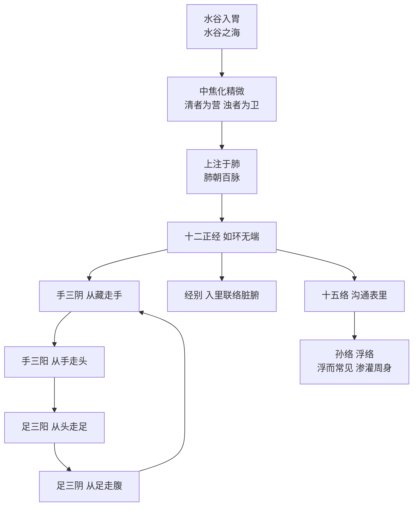

# 第040课 单元总结 · 气血经络一张图

## ① 复习昨天

先自己答，答完再展开对照（第039课·食气入胃·生病起于过用）。

> [!question]- 问题一：请背出水液代谢那段原文。
> **饮入于胃，游溢精气，上输于脾，脾气散精，上归于肺，通调水道，下输膀胱。水精四布，五经并行。**

> [!question]- 问题二：谷食精气的输布路线是怎样的？"肺朝百脉"何解？
> 食气入胃→散精于肝（养筋）→浊气归心（入脉）→经气归肺→**肺朝百脉**→输精于皮毛。"朝"即朝会：百脉之气汇于肺，肺为输布总枢纽。

> [!question]- 问题三：《经脉别论》的发病通则是哪六个字？举两个例子。
> **生病起于过用。**如饮食过量、劳倦过度、情志过极、房室不节、久坐熬夜——凡超过常度之"用"皆可致病。

## ② 本单元知识地图

本单元十课讲了两件事：**资源**（气血津液从哪来、有几种、存在哪）与**道路**（经络怎样把资源送到全身）。

**气血津液一张表**（皆源于水谷，一气化六）：

| 名目 | 原文定义（《灵枢·决气》） | 要点 | 汇聚之海 |
|---|---|---|---|
| 精 | 两神相搏，合而成形，常先身生 | 生命之种，先身而有 | （化髓充脑）脑为髓海 |
| 气 | 上焦开发，宣五谷味……若雾露之溉 | 如雾露熏肤充身泽毛 | 膻中为气海 |
| 津 | 腠理发泄，汗出溱溱 | 清稀走表，汗即其泄 | —— |
| 液 | 谷入气满，淖泽注于骨……补益脑髓 | 稠厚走里，滑利濡养 | —— |
| 血 | 中焦受气取汁，变化而赤 | 中焦所化，奉养生身 | 冲脉为血海（十二经之海） |
| 脉 | 壅遏营气，令无所避 | 约束血气的通道 | （源头）胃为水谷之海 |

另有**营卫**一对：清者为营，行脉中而主营养；浊者为卫，行脉外而主卫外——营周不休，五十而复大会，如环无端；卫气昼行于阳则寤、夜入于阴则寐。

**经络系统一张图**：

流注次序：肺→大肠→胃→脾→心→小肠→膀胱→肾→心包→三焦→胆→肝→复归于肺（口诀：肺大胃脾心小肠，膀肾包焦胆肝乡）。六对表里：肺—大肠、心包—三焦、心—小肠、脾—胃、肝—胆、肾—膀胱。

（提醒：这张图是中医的功能模型——气血运行的"路线图"，不是解剖图。）

## ③ 重点原文回顾

本单元必背句清单，逐句先背再核对：

> [!quote] 本单元必背句
> - 第031课：营在脉中，卫在脉外，营周不休，五十而复大会，阴阳相贯，如环无端。（灵枢·营卫生会）
> - 第032课：人受气于谷，谷入于胃，以传与肺，五藏六府，皆以受气，其清者为营，浊者为卫。（灵枢·营卫生会）
> - 第033课：中焦受气取汁，变化而赤，是谓血。（灵枢·决气）
> - 第034课：人有髓海，有血海，有气海，有水谷之海，凡此四者，以应四海也。（灵枢·海论）
> - 第035课：经脉者，所以能决死生，处百病，调虚实，不可不通。（灵枢·经脉）
> - 第036课：肺手太阴之脉，起于中焦，下络大肠。（灵枢·经脉）
> - 第037课：手之三阴，从藏走手；手之三阳，从手走头；足之三阳，从头走足；足之三阴，从足走腹。（灵枢·逆顺肥瘦）
> - 第038课：诸脉之浮而常见者，皆络脉也。（灵枢·经脉）
> - 第039课：饮入于胃，游溢精气，上输于脾，脾气散精，上归于肺，通调水道，下输膀胱。（素问·经脉别论）

## ④ 综合问答

专攻易混点。先自己答，再展开对照。

> [!question]- 问1：营与卫的区别，请从来源、部位、功能、与睡眠的关系四个方面说清楚。
> **来源**：同源于水谷之气——清者为营，浊者为卫。**部位**：营在脉中（与血同行），卫在脉外（布散肌肤腠理）。**功能**：营主营养濡养，卫主温分肉、司开合、卫外御邪。**与睡眠**：卫气昼行于阳则寤，夜入于阴则寐；营卫失常则"昼不精，夜不瞑"。

> [!question]- 问2：精、气、津、液、血、脉六者，为什么说"名有六，实一气"？请任背两条原文定义。
> 六者同源于一气（先天之精与水谷之气），因部位、形态、功用不同而立六名，且可相互化生（津血同源、精血互生）。定义如：血——"中焦受气取汁，变化而赤，是谓血"；脉——"壅遏营气，令无所避，是谓脉"（余见上表）。

> [!question]- 问3：津与液最容易混，如何一句话区分？各举一个临床相关的说法。
> **津清稀走表，液稠厚走里。**津：汗即津之外泄，"夺汗者无血"提示汗多伤津进而伤血；液：注于骨节脑髓，久病深入则耗液，见关节涩滞、脑转耳鸣。

> [!question]- 问4：四海的名称与部位，最易张冠李戴——请准确说出四组对应，并指出哪个海是根基。
> **胃**为水谷之海，**冲脉**为血海（十二经之海），**膻中**为气海，**脑**为髓海。根基是胃（水谷之海）：气血髓皆由水谷化生。易错点：气海是膻中（胸中宗气所聚），不要与脐下气海穴混为一谈；血海是冲脉，不是肝。

> [!question]- 问5：十二经的走向与交接规律是什么？表里配对有哪六对？
> 走向：手三阴从藏走手，手三阳从手走头，足三阳从头走足，足三阴从足走腹。交接：表里阴阳经交于**手足末端**，同名阳经会于**头面**（头为诸阳之会），阴经相交于**胸腹**。六对表里：肺—大肠、心包—三焦、心—小肠、脾—胃、肝—胆、肾—膀胱。

> [!question]- 问6：经与络怎样分别？"经脉不可见"，医生凭什么诊察它？
> 经深络浅：经"伏行分肉之间，深而不见"，"诸脉之浮而常见者，皆络脉也"；经如干流，络如支渠，再分孙络浮络如毛渠。经脉虚实"以气口知之"——切寸口脉以候经气。

## ⑤ 易混点提醒

> [!warning] 六个最容易搞错的地方
> 1. **营卫的"清浊"**是性状走向之分（清柔为营、慓悍为卫），不是干净与肮脏；
> 2. **津与液**：津走表而稀（汗），液走里而稠（骨节脑髓）——方向相反不要背倒；
> 3. **四海对应**：胃—水谷、冲脉—血、膻中—气、脑—髓；"气海"在胸中膻中，勿与脐下穴名相混；
> 4. **走向口诀**中只有手三阴是"从藏走手"，其余皆在体表接力——四句顺序不能乱；
> 5. **流注次序**里表里两经必相邻（肺→大肠、胃→脾……），背错一处则环断；
> 6. **经络是功能模型**：路线图而非解剖图——切勿把经脉等同于血管或神经。

## ⑧ 生活实践

本单元收官，做一次"一张图"输出：**合上笔记，凭记忆把知识地图默画一遍**——左边写六名与四海，右边画十二经的环（四段走向＋流注口诀），中间用"水谷→中焦→肺朝百脉"连起来。画完对照本课地图查漏——画得出来，这个单元才真正装进了脑子。

## ⑨ 内经札记

> [!abstract] 今日札记（请抄进 [[03-内经札记]]）
> 气血津液是流动的资源，经络是运输的道路——源足而道通，则百病无所生；治病之要，不外开源与通道。

## 复习卡片

#flashcards/内经100课

第四单元两大主题::资源（气血津液：一气化六、四海所聚）与道路（经络：十二经如环无端、络脉渗灌周身）
营与卫一句话之别::清者为营行脉中主营养；浊者为卫行脉外主卫外
四海对应::胃—水谷之海；冲脉—血海；膻中—气海；脑—髓海
本单元总纲必背句::经脉者，所以能决死生，处百病，调虚实，不可不通

---

上一课：[[第039课-食气入胃·生病起于过用]] ｜ 下一课：[[第041课-阳气者，若天与日]]
复习节点：学完后第1、2、4、7、14、30天各复习一次（见 [[02-复习日程表]]）
